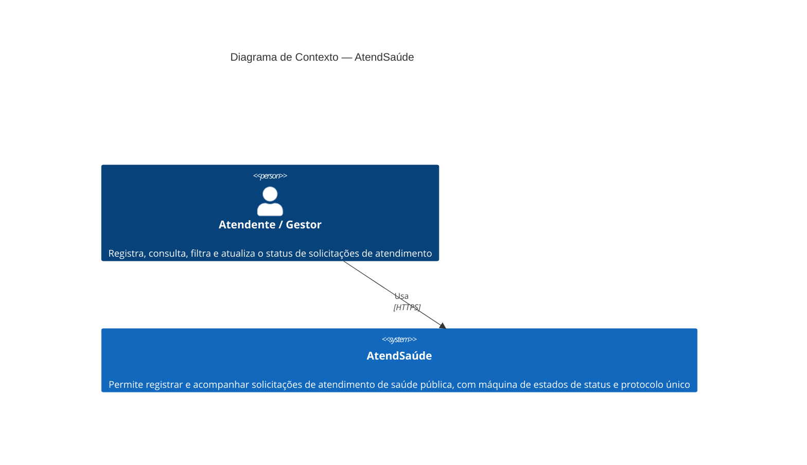
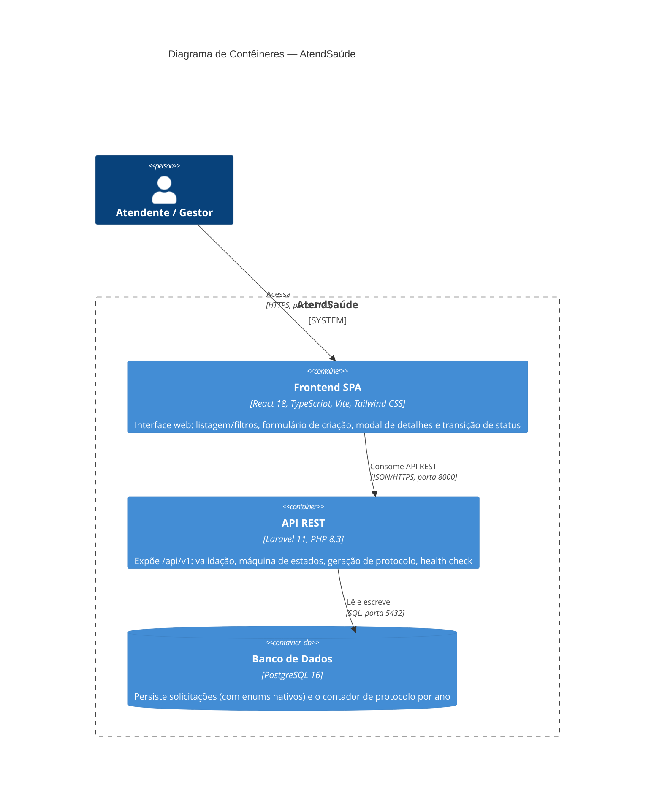

<!-- ficheiro: docs/modelo_c4.md -->

# Arquitetura — Modelo C4

## Nível 1 — Diagrama de Contexto

O AtendSaúde é tratado como um sistema único, visto de fora: um ator humano interage com ele via navegador. Não há integrações com sistemas externos de terceiros nesta versão (sem gateway de pagamento, SSO externo, etc.).

## Nível 2 — Diagrama de Contêineres

Decompõe o sistema em três contêineres, cada um em seu próprio serviço Docker, comunicando-se apenas pela rede interna `atendsaude_net`:

### Responsabilidade de cada contêiner

| Contêiner | Responsabilidade | Não faz |
|---|---|---|
| Frontend SPA | Renderização, estado de UI (loading/erro/vazio), validação client-side apenas como UX (nunca como fonte de verdade), tipagem dos contratos (`src/types/solicitacao.ts`) | Não acessa o banco diretamente; não reimplementa a máquina de estados como regra definitiva |
| API REST | Validação (FormRequests), regra de negócio (Actions), persistência via Eloquent, contrato versionado `/api/v1` | Não lida com apresentação; não conhece detalhes de UI |
| Banco de Dados | Persistência relacional, integridade referencial e de domínio (enums nativos, `CHECK` constraints) | Não contém lógica de aplicação além de constraints declarativas |

### Caminho de evolução (arquitetura de serviços por domínio)

Hoje o backend é um monólito modular único (`app/Actions/Solicitacao/`, `app/Models/Solicitacao.php`). Se o domínio crescer (ex.: múltiplas unidades de saúde, autenticação multi-perfil, notificações), o próximo passo natural seria:

1. Extrair o domínio de solicitações para um módulo isolado dentro do próprio monólito (`app/Domain/Solicitacoes/`), preparando fronteiras claras antes de qualquer split físico.
2. Somente então considerar um serviço separado (ex.: um serviço de notificações assíncronas), comunicando-se por eventos de domínio já emitidos internamente, minimizando o retrabalho de uma eventual extração para microsserviço.
