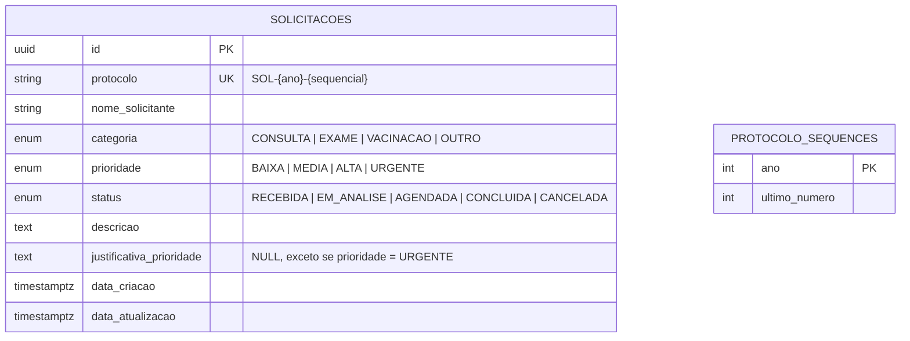

<!-- ficheiro: docs/modelo_dados.md -->

# Modelo de Dados — AtendSaúde

## Diagrama Entidade-Relacionamento (ERD)

`SOLICITACOES` é a entidade central do domínio. `PROTOCOLO_SEQUENCES` é uma tabela de apoio (contador atômico por ano) — não há chave estrangeira entre as duas: a ligação é **funcional** (a Action de criação lê/incrementa o contador para gerar o campo `protocolo`), não relacional.



## Dicionário de Dados

| Campo | Tipo (Postgres) | Restrições | Observação |
|---|---|---|---|
| `id` | `UUID` | `PRIMARY KEY` | Gerado na aplicação (Model `HasUuids`), não pelo banco |
| `protocolo` | `VARCHAR(20)` | `NOT NULL`, `UNIQUE` | Gerado por `GerarProtocoloAction`, formato `SOL-{ano}-{sequencial:04d}` |
| `nome_solicitante` | `VARCHAR(150)` | `NOT NULL` | Nome fictício, sem dados pessoais reais |
| `categoria` | `categoria_solicitacao` (enum nativo) | `NOT NULL` | `CONSULTA`, `EXAME`, `VACINACAO`, `OUTRO` |
| `prioridade` | `prioridade_solicitacao` (enum nativo) | `NOT NULL` | `BAIXA`, `MEDIA`, `ALTA`, `URGENTE` |
| `status` | `status_solicitacao` (enum nativo) | `NOT NULL`, default `RECEBIDA` | Ver máquina de estados em `docs/contrato_api.md` |
| `descricao` | `TEXT` | `NOT NULL` | Resumo da solicitação |
| `justificativa_prioridade` | `TEXT` | `NULL` | Obrigatório na validação de aplicação (`StoreSolicitacaoRequest`) e reforçado por `CHECK` no banco quando `prioridade = 'URGENTE'` |
| `data_criacao` | `TIMESTAMPTZ` | `NOT NULL`, default `now()` | Mapeado para `CREATED_AT` do Eloquent |
| `data_atualizacao` | `TIMESTAMPTZ` | `NOT NULL`, default `now()` | Mapeado para `UPDATED_AT` do Eloquent |

## Índices

| Índice | Colunas | Motivo |
|---|---|---|
| `idx_solicitacoes_status` | `status` | Filtro por status (`GET /solicitacoes?status=`) |
| `idx_solicitacoes_categoria` | `categoria` | Filtro por categoria |
| `idx_solicitacoes_prioridade` | `prioridade` | Filtro por prioridade |
| `idx_solicitacoes_criacao` | `data_criacao DESC` | Ordenação padrão da listagem |
| `idx_solicitacoes_filtros_combo` | `status, categoria, prioridade` | Caso comum de múltiplos filtros combinados |

## Restrições de Integridade

```sql
CONSTRAINT chk_justificativa_urgente
    CHECK (prioridade <> 'URGENTE' OR justificativa_prioridade IS NOT NULL)
```

Garantida no nível do banco — vale mesmo para inserts que não passem pela camada de validação do Laravel (ex.: scripts administrativos, migrações de dados futuras).
